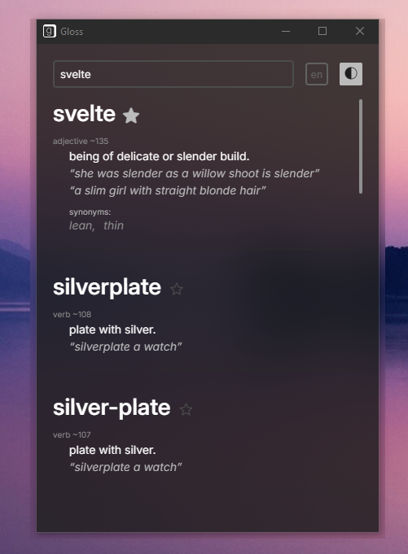

# Fast, minimal, clean, multi-lingual, cross-platform dictionary app

Included languages: English (default), Latvian. 
More can be added easily by downloading the wordnet XML file in LMF format of a language, if available online, and parsing it with the included parser.

### Tech stack
* Tauri - backend
* Svelte 5 (with Vite 6 and SCSS) - frontend
* Rust ^1.88.x - used by Tauri
* Node.js ^22.x (or Deno or Bun) - used by frontend
* Python ^3.12.x - for the wordnet parser script

## Recommended IDE Setup

[VS Code](https://code.visualstudio.com/) + [Svelte](https://marketplace.visualstudio.com/items?itemName=svelte.svelte-vscode) + [Tauri](https://marketplace.visualstudio.com/items?itemName=tauri-apps.tauri-vscode) + [rust-analyzer](https://marketplace.visualstudio.com/items?itemName=rust-lang.rust-analyzer).
